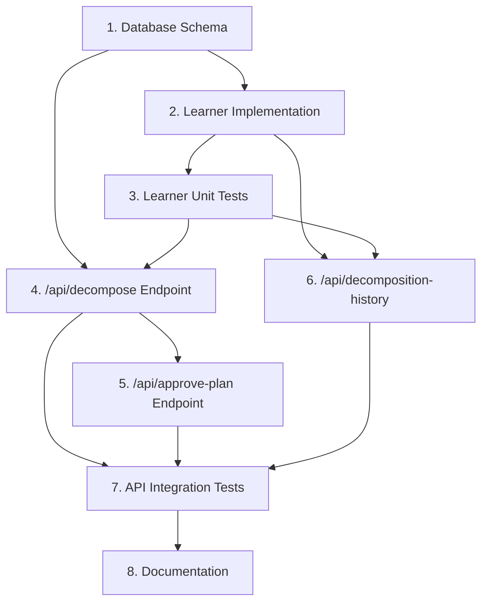

# Backend Tasks - Smart Task Decomposition Engine (Milestones 3 & 4)

## Learning Module Tasks (Milestone 3)

### 1. Database Schema Preparation
- **Description**: Create database schema for decomposition execution tracking
- **Acceptance Criteria**:
  - SQLite schema created in metrics.py
  - Indexes added for domain and completed_at
- **Complexity**: Low
- **Estimated Time**: 30 mins
- **Dependencies**: None

### 2. DecompositionLearner: Core Implementation
- **Description**: Implement core methods in DecompositionLearner
- **Key Methods**:
  - record_execution()
  - improve_estimates()
  - suggest_improvements()
  - get_historical_accuracy()
- **Acceptance Criteria**:
  - All methods functional
  - Handles edge cases (empty database)
  - Returns structured data
- **Complexity**: High
- **Estimated Time**: 2 hours
- **Dependencies**: Task 1 (Database Schema)

### 3. Decomposition Learner Unit Tests
- **Description**: Comprehensive unit tests for DecompositionLearner
- **Test Cases**:
  - Database initialization
  - Record execution with various scenarios
  - Estimate improvement logic
  - Historical accuracy calculations
- **Acceptance Criteria**:
  - > 80% code coverage
  - All tests pass
  - Handles edge cases
- **Complexity**: Medium
- **Estimated Time**: 1 hour
- **Dependencies**: Task 2 (Core Implementation)

## API Endpoints Tasks (Milestone 4)

### 4. Decomposition API Endpoint: /api/decompose
- **Description**: Implement POST endpoint for task decomposition
- **Features**:
  - Accept task description
  - Generate comprehensive decomposition plan
  - Optional resource estimation
- **Acceptance Criteria**:
  - Responds within 5 seconds
  - Returns complete DecompositionPlan
  - Handles invalid requests
- **Complexity**: High
- **Estimated Time**: 1.5 hours
- **Dependencies**: 
  - Milestone 1-2 (Core Engine)
  - Task 2 (Learning Module)

### 5. Plan Approval API Endpoint: /api/approve-plan
- **Description**: Implement POST endpoint for plan approval workflow
- **Features**:
  - Handle approve/reject/modify actions
  - Log user decisions
  - Placeholder for execution initiation
- **Acceptance Criteria**:
  - Supports all three actions
  - Validates modifications
  - Appropriate status codes
- **Complexity**: Medium
- **Estimated Time**: 1 hour
- **Dependencies**: Task 4 (Decompose Endpoint)

### 6. Historical Metrics API Endpoint: /api/decomposition-history
- **Description**: Implement GET endpoint for historical accuracy metrics
- **Features**:
  - Return accuracy metrics
  - Support domain filtering
  - Return recent executions
- **Acceptance Criteria**:
  - Responds within 1 second
  - Supports query parameters
  - Returns structured metrics
- **Complexity**: Medium
- **Estimated Time**: 1 hour
- **Dependencies**: 
  - Task 2 (Learning Module)
  - Task 3 (Unit Tests)

### 7. API Integration Tests
- **Description**: Comprehensive integration tests for new endpoints
- **Test Scenarios**:
  - Endpoint request/response validation
  - Error handling
  - Real-world decomposition scenarios
- **Acceptance Criteria**:
  - > 80% test coverage
  - All tests pass
  - Comprehensive error scenario testing
- **Complexity**: High
- **Estimated Time**: 1.5 hours
- **Dependencies**: Tasks 4-6 (All API Endpoints)

## Project-Wide Tasks

### 8. Documentation and OpenAPI Integration
- **Description**: Update documentation and generate OpenAPI specs
- **Features**:
  - Docstrings for new methods
  - OpenAPI/Swagger documentation
  - README updates
- **Acceptance Criteria**:
  - Clear method documentation
  - Swagger docs generated
  - README reflects new functionality
- **Complexity**: Low
- **Estimated Time**: 45 mins
- **Dependencies**: All previous tasks

## Task Dependencies Graph

## Estimated Total Time
- Learning Module: 3.5 hours
- API Endpoints: 3.5 hours
- Documentation: 0.75 hours
**Total: ~7.75 hours**
