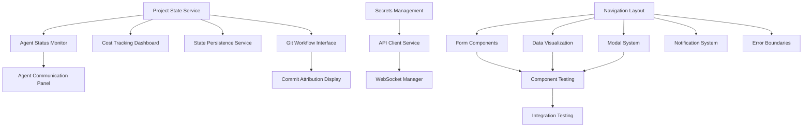

# Frontend Tasks - Foundation Infrastructure

## Milestone Overview
Establish core frontend infrastructure for enhanced git workflows, state management, and security including frequent coherent commits, branch-based development, state persistence & recovery, and secrets management.

## Task Breakdown

### Core Infrastructure Components

#### Task 1: Project State Management Service
**Description**: Create a frontend service to manage project state, task tracking, and milestone progress
**Acceptance Criteria**: 
- Service can create, read, update project state
- Tracks tasks with status, assignments, and dependencies
- Maintains milestone progress with completion metrics
- Provides state persistence and recovery capabilities
**Dependencies**: None (foundational)
**Complexity**: Medium

#### Task 2: Git Workflow Management Interface
**Description**: Build UI components for git branch management, commit history, and merge operations
**Acceptance Criteria**:
- Display current branch status and commit history
- Allow branch creation, switching, and deletion through UI
- Show merge conflicts and resolution options
- Visualize branch topology and relationships
**Dependencies**: Task 1 (project state)
**Complexity**: Complex

#### Task 3: Cost Tracking Dashboard Components
**Description**: Create components to display API costs, usage metrics, and budget tracking
**Acceptance Criteria**:
- Real-time cost display with provider breakdown
- Budget alerts and threshold warnings
- Historical usage charts and trends
- Export capabilities for cost reports
**Dependencies**: Task 1 (project state)
**Complexity**: Medium

#### Task 4: State Persistence Service
**Description**: Implement frontend service for checkpoint creation, state backup, and recovery operations
**Acceptance Criteria**:
- Create and restore application state checkpoints
- Handle interrupted operations gracefully
- Provide manual and automatic backup triggers
- Display recovery options when state corruption detected
**Dependencies**: Task 1 (project state)
**Complexity**: Medium

#### Task 5: Secrets Management Interface
**Description**: Build secure UI for managing API keys, credentials, and configuration secrets
**Acceptance Criteria**:
- Secure form for adding/editing API credentials
- Masked display of sensitive information
- Validation of credential formats and permissions
- Audit trail of credential access and modifications
**Dependencies**: None (security critical)
**Complexity**: Complex

### Agent Coordination Components

#### Task 6: Agent Status Monitor
**Description**: Create real-time display of agent execution status, progress, and health metrics
**Acceptance Criteria**:
- Live status updates for active agents
- Progress indicators for long-running tasks
- Error state display with diagnostic information
- Agent performance metrics and success rates
**Dependencies**: Task 1 (project state)
**Complexity**: Medium

#### Task 7: Agent Communication Panel
**Description**: Build interface for inter-agent messaging, coordination, and conflict resolution
**Acceptance Criteria**:
- Display agent-to-agent communication logs
- Show coordination events and handoffs
- Provide manual intervention options for conflicts
- Visual representation of agent collaboration workflows
**Dependencies**: Task 6 (agent status)
**Complexity**: Complex

#### Task 8: Commit Attribution Display
**Description**: Create components to show agent authorship, commit quality, and automated commit formatting
**Acceptance Criteria**:
- Display commits with proper agent attribution
- Show commit quality scores and metrics
- Format commit messages according to standards
- Link commits to originating tasks and agents
**Dependencies**: Task 2 (git workflow)
**Complexity**: Simple

### User Experience Components

#### Task 9: Navigation and Layout Framework
**Description**: Build responsive navigation system and page layout components
**Acceptance Criteria**:
- Responsive sidebar navigation with collapsible sections
- Header with breadcrumb navigation and user context
- Main content area with proper spacing and typography
- Mobile-friendly responsive design
**Dependencies**: None (foundational)
**Complexity**: Simple

#### Task 10: Form Components Library
**Description**: Create reusable form components with validation, error handling, and accessibility
**Acceptance Criteria**:
- Input components with built-in validation
- Form containers with error state management
- Accessible form labels and ARIA attributes
- Consistent styling matching design system
**Dependencies**: Task 9 (layout framework)
**Complexity**: Medium

#### Task 11: Data Visualization Components
**Description**: Build charts, graphs, and metrics display components for dashboards
**Acceptance Criteria**:
- Line charts for cost and performance trends
- Progress bars and completion indicators
- Real-time updating charts with smooth animations
- Responsive design for different screen sizes
**Dependencies**: Task 9 (layout framework)
**Complexity**: Medium

#### Task 12: Modal and Dialog System
**Description**: Create modal dialogs for confirmations, forms, and detailed views
**Acceptance Criteria**:
- Reusable modal component with different sizes
- Form modals for editing configurations
- Confirmation dialogs for destructive actions
- Accessibility features (focus management, escape key)
**Dependencies**: Task 9 (layout framework)
**Complexity**: Simple

### Integration and API Components

#### Task 13: API Client Service
**Description**: Build frontend service for backend communication with error handling and retry logic
**Acceptance Criteria**:
- RESTful API client with standardized error handling
- Automatic retry logic for failed requests
- Request/response logging for debugging
- Authentication token management
**Dependencies**: Task 5 (secrets management)
**Complexity**: Medium

#### Task 14: WebSocket Connection Manager
**Description**: Implement real-time communication service for live updates and agent events
**Acceptance Criteria**:
- Persistent WebSocket connection with reconnection logic
- Event-driven updates for agent status and progress
- Connection status indicators
- Message queuing for offline scenarios
**Dependencies**: Task 13 (API client)
**Complexity**: Complex

#### Task 15: Notification System
**Description**: Create toast notifications, alerts, and status indicators for user feedback
**Acceptance Criteria**:
- Toast notifications for success/error/info messages
- System-wide alert banners for important status
- Progress notifications for long operations
- Dismissible notifications with auto-timeout
**Dependencies**: Task 9 (layout framework)
**Complexity**: Simple

### Testing and Quality Components

#### Task 16: Component Testing Framework
**Description**: Set up testing infrastructure for React components with mocking and assertions
**Acceptance Criteria**:
- Jest and React Testing Library configuration
- Component test utilities and helpers
- Mock services for isolated component testing
- Test coverage reporting and thresholds
**Dependencies**: All component tasks
**Complexity**: Medium

#### Task 17: Integration Testing Suite
**Description**: Create end-to-end testing for user workflows and component interactions
**Acceptance Criteria**:
- Cypress or Playwright test configuration
- Critical user journey test scenarios
- API integration testing with mock backends
- Visual regression testing capabilities
**Dependencies**: Task 16 (component testing)
**Complexity**: Complex

#### Task 18: Error Boundary Implementation
**Description**: Add error boundaries for graceful failure handling and user error reporting
**Acceptance Criteria**:
- Component-level error boundaries with fallback UI
- Global error boundary for unhandled exceptions
- Error reporting to logging service
- User-friendly error messages with recovery options
**Dependencies**: Task 9 (layout framework)
**Complexity**: Simple

## Task Dependencies

## Implementation Order

### Phase 1: Foundation (Tasks 1, 5, 9)
- Project State Management Service
- Secrets Management Interface
- Navigation and Layout Framework

### Phase 2: Core Infrastructure (Tasks 2, 3, 4, 13)
- Git Workflow Management Interface
- Cost Tracking Dashboard Components
- State Persistence Service
- API Client Service

### Phase 3: User Experience (Tasks 6, 10, 11, 12, 15, 18)
- Agent Status Monitor
- Form Components Library
- Data Visualization Components
- Modal and Dialog System
- Notification System
- Error Boundary Implementation

### Phase 4: Advanced Features (Tasks 7, 8, 14)
- Agent Communication Panel
- Commit Attribution Display
- WebSocket Connection Manager

### Phase 5: Quality Assurance (Tasks 16, 17)
- Component Testing Framework
- Integration Testing Suite

## Technical Architecture

### State Management
- React Context API for global state (project, user, settings)
- Local component state for UI interactions
- Persistent state service for checkpoints and recovery

### Styling Approach
- Tailwind CSS for utility-first styling
- CSS Modules for component-specific styles
- Design system tokens for consistent theming

### API Integration
- Axios for HTTP requests with interceptors
- WebSocket for real-time updates
- Error boundary pattern for resilient API handling

### Testing Strategy
- Unit tests for all utility functions and services
- Component tests for UI behavior and interactions
- Integration tests for critical user workflows
- Visual regression tests for UI consistency

## Complexity Summary
- Simple Tasks: 4 (Tasks 8, 9, 12, 15, 18)
- Medium Tasks: 8 (Tasks 1, 3, 4, 6, 10, 11, 13, 16)
- Complex Tasks: 6 (Tasks 2, 5, 7, 14, 17)

**Total Estimated Tasks: 18**
**Implementation Timeline: 4-5 sprints**